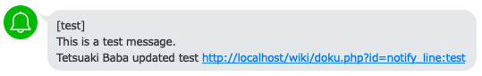

# DokuWiki LINE Notifier
This plugin is fored and inspired from https://github.com/mallchin/dokuwiki-line-notifier.
A DokuWiki plugin that notifies to line notify.


## Install
Clone the repository into your DokuWiku plugins folder
```
$ git clone https://github.com/TetsuakiBaba/dokuwiki-line-notifier /var/lib/dokuwiki/lib/plugins/linenotifier
```

## Configure

1. Create an LINE notify token from here: https://notify-bot.line.me/ja/
2. Enter the token into the linenotifier configuration section in DokuWiki's Configuration Settings

    Namespace works only single indication, such as test, sample. For example, test:test1 namespace does not work.
